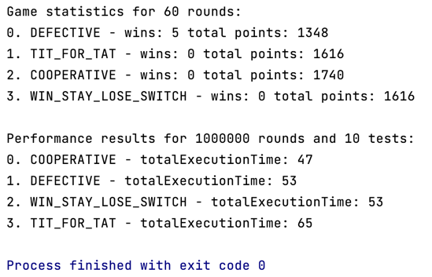

# solidgate-prisoners-dilemma
Here are results of my implementation for Prisoner's Dilemma:

As we can see, DEFECTIVE strategy is the most optimal for this dilemma in terms of wins,
but COOPERATIVE achieves the highest score.

The optimality of DEFECTIVE strategy comes from the Game theory - if we always defect, we can't lose, so we will win or there will be a draw.
